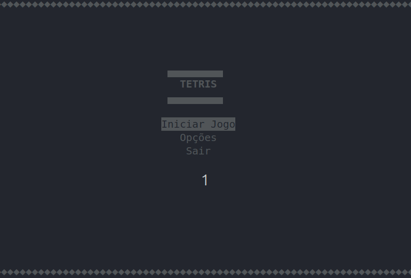

# 🧱 TETRIS TERMINAL — Powered by Python + Curses

Um clone funcional do clássico Tetris rodando inteiramente no terminal, desenvolvido em Python com `curses` e `NumPy`.

> **Status do projeto:** concluído / arquivado.  
> Este repositório preserva a versão original do jogo. Ele foi construído intencionalmente como um **monolito procedural** para atender a restrições acadêmicas específicas, demonstrando que é possível implementar mecânicas relativamente complexas , como o **Super Rotation System (SRS)** , operando apenas em modo texto e sem uso de orientação a objetos.

---

## 🧩 Sobre o projeto

Este Tetris foi desenvolvido com foco em fluidez, responsividade e fidelidade mecânica dentro das limitações de um terminal. O jogo inclui:

- **Super Rotation System (SRS) e wall kicks** para uma rotação mais próxima dos jogos modernos.
- **Peça especial: bomba 💣**, capaz de explodir áreas `3x3` do tabuleiro e adicionar uma camada estratégica extra.
- **Sistema de combos e progressão**, com aumento dinâmico de velocidade e pontuação.
- **Interface textual**, totalmente renderizada no terminal via `curses`.

---

## 📚 Contexto acadêmico e restrições de engenharia

Este projeto surgiu como parte da disciplina de **MI-Algoritmos** na **Universidade Estadual de Feira de Santana (UEFS)**, dentro da metodologia **PBL (Problem-Based Learning)**.

Durante o desenvolvimento, foram aplicadas restrições intencionais para priorizar raciocínio lógico, controle de fluxo e resolução direta de problemas em um ambiente de implementação limitado:

- 🚫 **Proibido o uso de orientação a objetos (classes).**
- 🚫 **Proibida a modularização em múltiplos arquivos próprios.**
- ⚠️ **Código centralizado em um único arquivo `.py`.**
- ⏱️ **Prazo reduzido de desenvolvimento.**

Essas restrições não foram limitações acidentais do projeto, mas parte do desafio de engenharia proposto.

---

## 🚀 Funcionalidades

- ✅ 7 peças clássicas do Tetris + 1 peça especial (bomba)
- ✅ Detecção de colisão e remoção de linhas
- ✅ Sistema de combo com tempo limite
- ✅ Progressão de dificuldade com aumento de velocidade por nível
- ✅ Menu inicial com seleção de dificuldade
- ✅ Mapeamento de controles (WASD ou setas)
- ✅ Sistema de pontuação por peça, combo e nível

---

## 🧠 Tecnologias utilizadas

- **Python 3.10+**
- **NumPy** — manipulação da matriz do tabuleiro
- **Curses** — renderização da interface em modo texto

---

## 🧪 Requisitos e execução

### Requisitos

- **Python 3.10** ou superior
- Sistema operacional compatível com `curses`

Compatibilidade:

- ✅ **Linux/macOS:** execução nativa
- ⚠️ **Windows:** recomendado usar **WSL** com **Windows Terminal**

---

## ▶️ Como rodar

1. Clone o repositório:

```bash
git clone https://github.com/seu-usuario/tetris-terminal.git
cd tetris-terminal
```

2.Crie e ative um ambiente virtual:

```bash
python3 -m venv venv
source venv/bin/activate
```

3.Instale as dependências:

```bash
pip install -r requirements.txt
```

4.Execute o jogo:

```bash
python3 tetris.py
```

---

## 🕹️ Controles

| Ação               | WASD | Setas |
| ------------------ | ---- | ----- |
| Mover à esquerda   | `A`  | `←`   |
| Mover à direita    | `D`  | `→`   |
| Mover para baixo   | `S`  | `↓`   |
| Rotacionar peça    | `W`  | `↑`   |
| Pausar / reiniciar | `P`  | `P`   |
| Sair               | `Q`  | `Q`   |

---

## 🐞 Bugs conhecidos

***Glitch visual em peças fixadas:** em execuções prolongadas, alguns blocos podem apresentar inconsistências visuais de cor no terminal.

**Causa técnica:** em certos ciclos de renderização procedural, `curses.color_pair()` pode receber valores que já foram sobrescritos no fluxo atual de atualização da tela.

Esse comportamento foi mantido nesta versão arquivada por fazer parte do estado original do projeto.

---

## 📸 Gameplay



---

## 🧑‍💻 Autora

**Stheffanny N. Alves**
🎓 Estudante de Engenharia de Computação — UEFS
🔐 Interesse em Cibersegurança e Engenharia de Software
📫 [stheffannyalvesnascimento@gmail.com](mailto:stheffannyalvesnascimento@gmail.com)

---

## 📄 Licença

Este projeto está sob a licença **MIT**.
Sinta-se livre para estudar, modificar, refatorar ou reutilizar o código.
